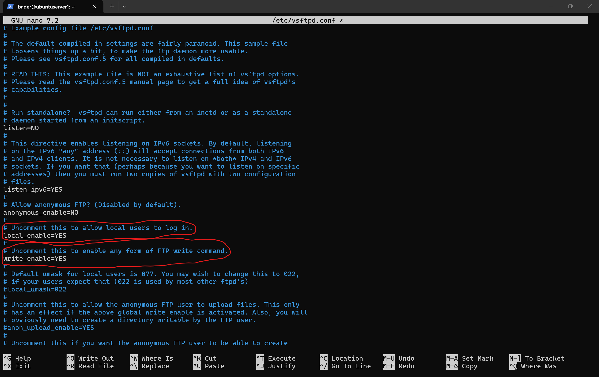
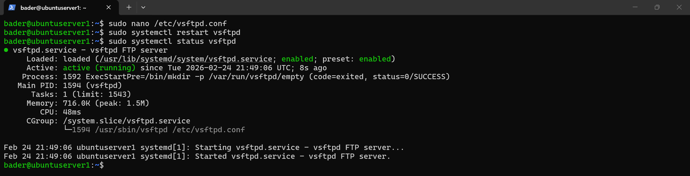
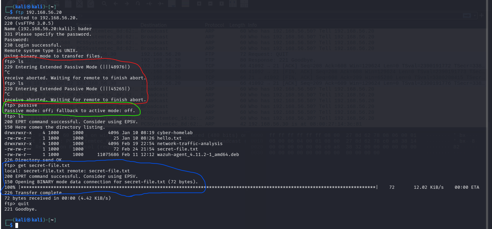
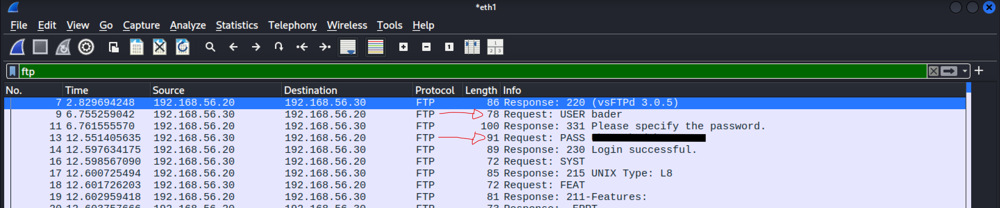
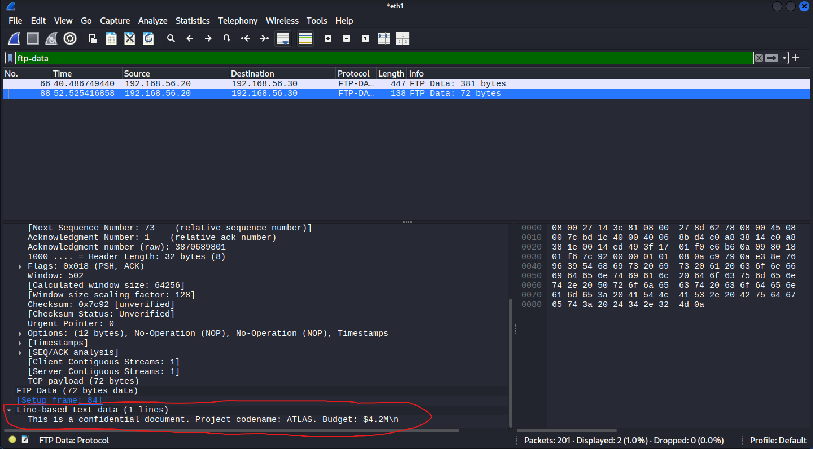
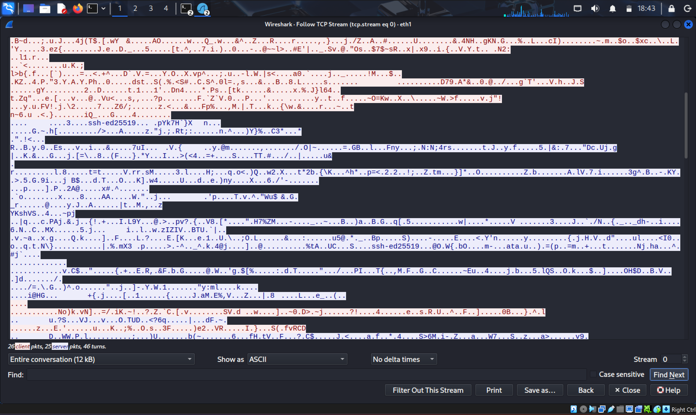

# FTP vs SFTP — Cleartext vs Encrypted File Transfer

## Objective

Demonstrate the security risk of using unencrypted file transfer protocols by capturing and comparing FTP (port 21) and SFTP (port 22) traffic in Wireshark. The goal is to show that FTP exposes login credentials **and** file contents in plaintext, while SFTP encrypts the entire session.

## Lab Environment

| Machine | OS | IP Address | Role |
|---|---|---|---|
| Kali Linux | Kali 2024+ | `192.168.56.30` | Attacker / Analyst |
| Ubuntu Server | Ubuntu 24.04.4 LTS | `192.168.56.20` | Target / FTP Server |

Both VMs are running in VirtualBox on a host-only network (`192.168.56.0/24`).

## Tools Used

- **Wireshark 4.6.0** (pre-installed on Kali)
- **vsftpd 3.0.5** — FTP server on Ubuntu
- **OpenSSH / SFTP** — already running on Ubuntu (SFTP runs over SSH)
- **UFW** — firewall on Ubuntu, [port 21 allowed](screenshots/ufw-allow-21-status-and-listening.png)

## Process

### 1. Setting Up the FTP Server

Installed vsftpd on Ubuntu:

```bash
sudo apt install vsftpd -y
```

Enabled local user login and write access in `/etc/vsftpd.conf`:



Restarted the service and confirmed it was active:



### 2. Creating a Test File

Created a file with sensitive-looking content to demonstrate data exposure:


### 3. Capturing FTP Traffic

Started Wireshark on Kali's `eth1` interface, then connected to the FTP server:

```bash
ftp 192.168.56.20
```

Logged in, listed files, downloaded `secret-file.txt`, and exited.

#### Troubleshooting — Passive Mode Hang

After logging in, running `ls` caused the session to hang twice. FTP passive mode requires the server to open a random high port for data transfer, which was being blocked. Rather than opening additional port ranges in UFW, I disabled passive mode to switch to active mode:

```
ftp> passive
Passive mode: off; fallback to active mode: off.
```

After switching, `ls` and `get` commands worked immediately.



### 4. Analyzing FTP in Wireshark

Applied the `ftp` display filter — the `USER` and `PASS` commands are visible directly in the packet list, no TCP stream follow needed:



Applied the `ftp-data` filter to inspect the data channel. The full contents of the transferred file are exposed at the bottom of the packet details:



FTP doesn't just expose credentials — it exposes every byte of data transferred.

### 5. Capturing SFTP Traffic

Started a new Wireshark capture, then connected via SFTP and repeated the same actions:

```bash
sftp bader@192.168.56.20
```

```
sftp> ls
sftp> get secret-file.txt
sftp> exit
```

[Screenshot: SFTP session from Kali](screenshots/sftp-connection-successful-and-get-command.png)

### 6. Analyzing SFTP in Wireshark

Following the TCP stream showed only encrypted data — no credentials, no file names, no file contents visible:



## Key Takeaways

| | FTP | SFTP |
|---|---|---|
| **Port** | 21 (+ dynamic data ports) | 22 |
| **Encryption** | None | Full session encryption (SSH) |
| **Credentials** | Visible in plaintext (`USER` / `PASS` commands) | Not visible |
| **File Contents** | Fully visible on `ftp-data` channel | Not visible |
| **Directory Listings** | Visible | Not visible |
| **Use in Production** | Never for sensitive data | Standard for secure file transfer |

FTP is worse than Telnet in one key way — it exposes not just credentials but also the actual data being transferred. An attacker sniffing the network gets both the keys and the contents. SFTP should always be used instead.
