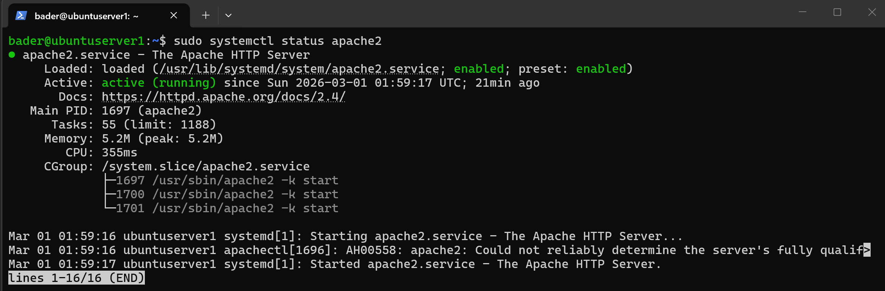
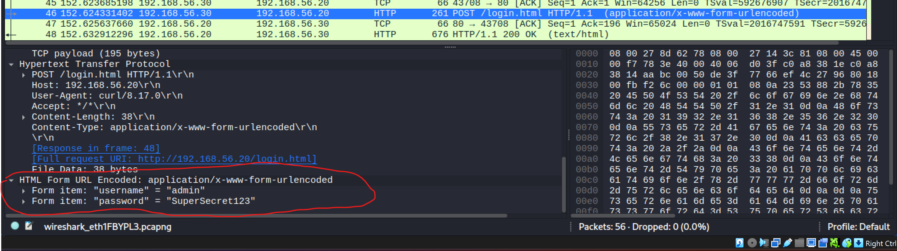
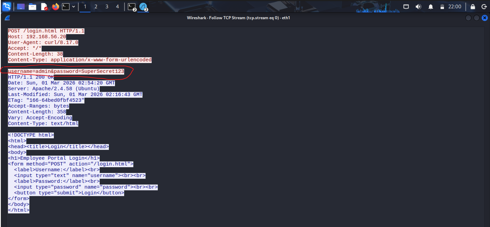
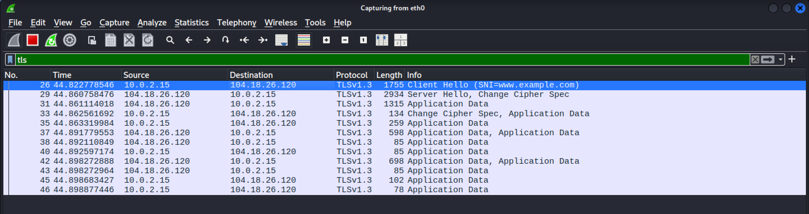
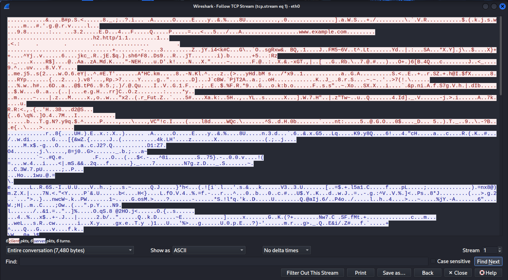

# HTTP vs HTTPS — Cleartext vs Encrypted Web Traffic

## Objective

Demonstrate the security risk of submitting data over unencrypted HTTP by capturing and comparing HTTP and HTTPS traffic in Wireshark. The goal is to show that HTTP exposes form submissions (including credentials) in plaintext, while HTTPS encrypts everything with TLS.

## Lab Environment

| Machine | OS | IP Address | Role |
|---|---|---|---|
| Kali Linux | Kali 2024+ | `192.168.56.30` (eth1) / `10.0.2.15` (eth0) | Analyst |
| Ubuntu Server | Ubuntu 24.04.4 LTS | `192.168.56.20` | Web Server (Apache) |

Kali has two network adapters: `eth1` (host-only, for local HTTP traffic to Ubuntu) and `eth0` (NAT, for internet-facing HTTPS traffic).

## Tools Used

- **Wireshark 4.6.0** (pre-installed on Kali)
- **Apache 2.4.58** — HTTP server on Ubuntu
- **curl 8.17.0** — used to send HTTP/HTTPS POST requests from Kali
- **UFW** — firewall on Ubuntu, [port 80 allowed](screenshots/ufw-status-80-allowed.png)

## Process

### 1. Setting Up the Web Server

Installed Apache on Ubuntu:

```bash
sudo apt install apache2 -y
```



Confirmed [port 80 listening](screenshots/port-80-listening.png) on Ubuntu.

Created a login form at `/var/www/html/login.html` with username and password fields. Verified from Kali using curl:


### 2. Capturing HTTP Traffic

Started Wireshark on Kali's `eth1` interface, then submitted fake credentials via HTTP POST:

```bash
curl -X POST http://192.168.56.20/login.html -d "username=admin&password=SuperSecret123"
```

### 3. Analyzing HTTP in Wireshark

Applied the `http` display filter. The POST request is visible with the full form data exposed in the packet details — Wireshark dissects it as "HTML Form URL Encoded" showing each field:



Following the TCP stream shows the complete request and server response in plaintext, including the credentials, HTTP headers, and the full HTML source of the page:



### 4. Capturing HTTPS Traffic

Started a new Wireshark capture on Kali's `eth0` interface (NAT adapter with internet access), then submitted the same credentials over HTTPS:

```bash
curl -X POST https://www.example.com/ -d "username=admin&password=SuperSecret123"
```

[Screenshot: curl HTTPS POST returns encrypted response](screenshots/kali-curl-https-post-example-com-returns-html.png)

### 5. Analyzing HTTPS in Wireshark

Applied the `tls` display filter. The traffic shows TLSv1.3 with a Client Hello containing only the server name (`SNI=www.example.com`). Every packet after the handshake is labeled "Application Data" — no readable content:



Following the TCP stream confirms everything is encrypted — no credentials, no HTTP headers, no page content visible:



## Key Takeaways

| | HTTP | HTTPS |
|---|---|---|
| **Port** | 80 | 443 |
| **Encryption** | None | TLS (v1.3 in this capture) |
| **Form Data / Credentials** | Fully visible in POST body | Not visible |
| **HTTP Headers** | Visible (User-Agent, Host, Content-Type) | Not visible |
| **Page Content** | Full HTML source visible in response | Not visible |
| **Visible to Attacker** | Everything — URL, headers, body, response | Only destination IP and SNI (server name) |
| **Use in Production** | Never for sensitive data | Standard for all web traffic |

HTTP exposes not just credentials but the entire conversation — request headers, form data, and the full server response. With HTTPS, an attacker on the network can only see that a connection was made to a server (via the SNI field in the Client Hello) but nothing about what was sent or received. This is why modern browsers warn users when submitting forms on HTTP pages.
