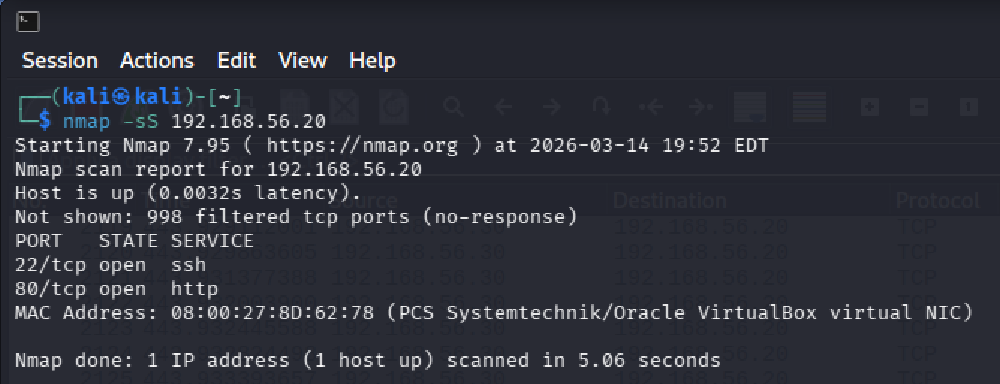
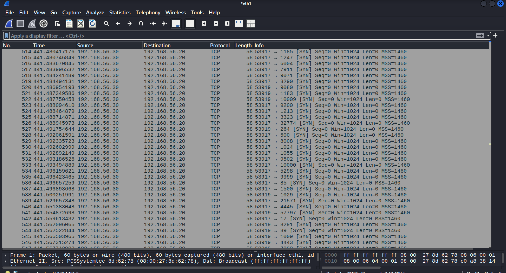
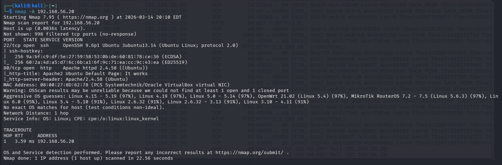
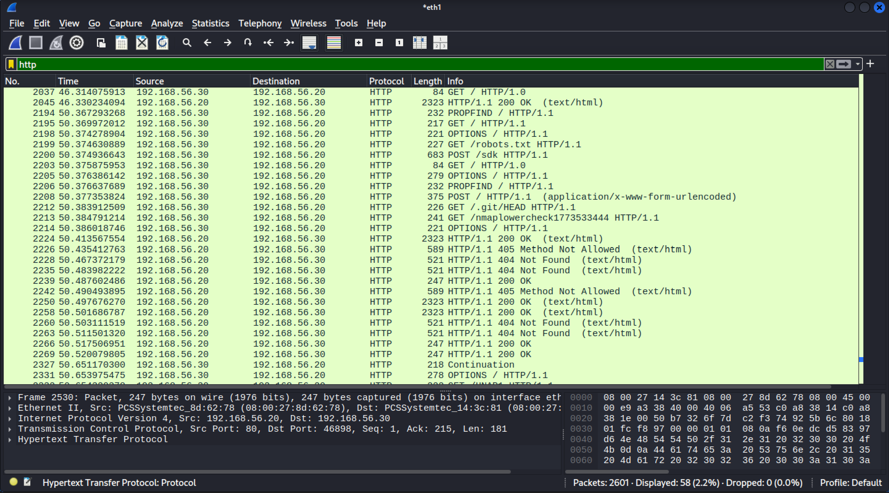
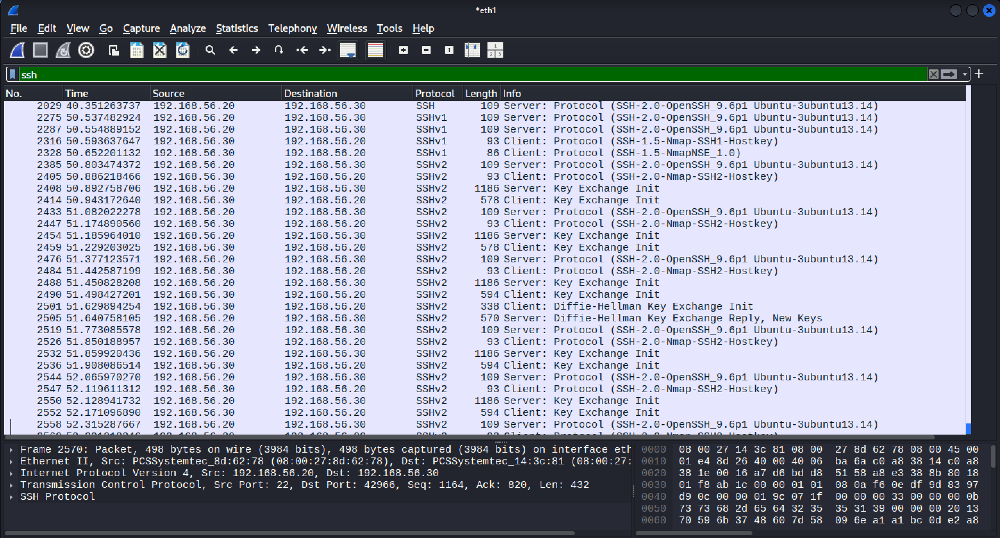
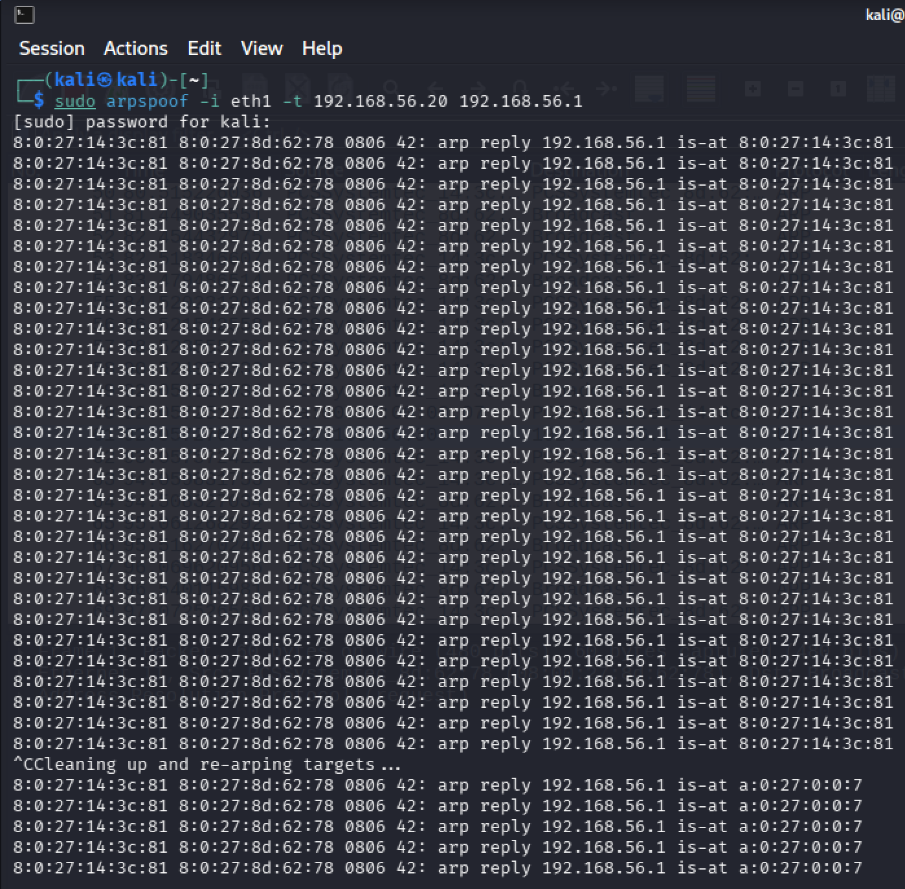
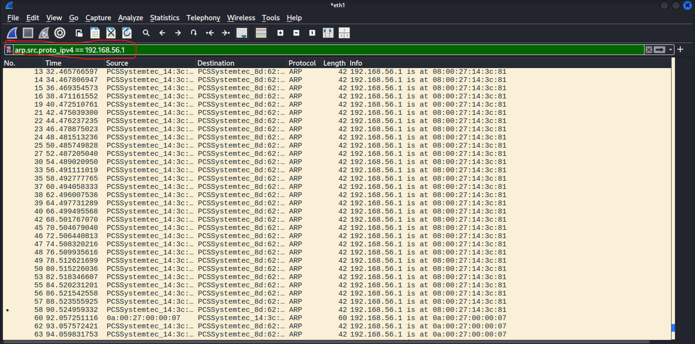

# Suspicious Traffic Detection — Identifying Scans and Attacks in Wireshark

## Objective

Generate common attack traffic in a lab environment and learn to identify what it looks like at the packet level. This section covers reconnaissance (port scanning) and active network attacks (ARP spoofing) — two of the most common types of suspicious traffic a network defender would need to detect.

## Lab Environment

| Machine | OS | IP Address | Role |
|---|---|---|---|
| Kali Linux | Kali 2024+ | `192.168.56.30` | Attacker |
| Ubuntu Server | Ubuntu 24.04.4 LTS | `192.168.56.20` | Target |

Both VMs are running in VirtualBox on a host-only network (`192.168.56.0/24`). The default gateway is `192.168.56.1` (VirtualBox host adapter).

## Tools Used

- **Wireshark 4.6.0** (pre-installed on Kali)
- **Nmap 7.95** — network scanner on Kali
- **arpspoof** (from `dsniff` package) — ARP spoofing tool on Kali

## Process

### 1. Nmap SYN Scan (Stealth Scan)

A SYN scan sends a TCP SYN packet to each port on the target. If the port is open, the target responds with SYN-ACK. If closed, it responds with RST. The scanner never completes the TCP handshake — it sends the SYN, gets the response, and moves on. This makes it faster and harder to detect than a full connection scan.

Started Wireshark on `eth1`, then ran the scan:

```bash
sudo nmap -sS 192.168.56.20
```

Nmap found two open ports — 22 (SSH) and 80 (HTTP):



#### What a Port Scan Looks Like in Wireshark

The unfiltered capture shows a massive flood of SYN packets from the same source, each targeting a different destination port. This rapid, sequential pattern hitting hundreds of ports in seconds is the signature of a port scan — normal traffic never looks like this:



Filtering for SYN-ACK responses (`tcp.flags.syn == 1 && tcp.flags.ack == 1`) reveals which ports actually responded as open. Only ports 80 and 22 sent SYN-ACKs back — matching the Nmap results:


---

### 2. Nmap Aggressive Scan

An aggressive scan (`-A`) goes far beyond a SYN scan. It performs OS detection, service version detection, script scanning, and traceroute. It actively connects to open ports and probes them to fingerprint exactly what software is running. This is much louder on the network.

```bash
sudo nmap -A 192.168.56.20
```

The results reveal detailed information about the target — SSH version, host keys, Apache version, OS guesses, and network distance:



#### What an Aggressive Scan Looks Like in Wireshark

Unlike the SYN scan which only sends SYN packets, the aggressive scan makes full connections and sends actual requests to probe services.

Filtering by `http` shows Nmap sending multiple HTTP requests to fingerprint the web server — `GET /`, `PROPFIND`, `POST /sdk`, `GET /robots.txt`, `GET /.git/HEAD`, and `GET /nmaplowercheck...`. These are Nmap's NSE (Nmap Scripting Engine) scripts probing for known paths and vulnerabilities. A real web server would almost never receive this combination of requests from a single source:



Filtering by `ssh` reveals something even more telling — Nmap identifies itself in the SSH client version strings as `SSH-1.5-Nmap-SSH1-Hostkey` and `SSH-2.0-Nmap-SSH2-Hostkey`. It connects multiple times using different protocol versions to enumerate the server's supported algorithms and extract host keys:



---

### 3. ARP Spoofing (Man-in-the-Middle)

ARP (Address Resolution Protocol) maps IP addresses to MAC addresses on a local network. When a device wants to reach the gateway (`192.168.56.1`), it asks "who has this IP?" and trusts whatever reply it gets — ARP has no authentication. ARP spoofing exploits this by flooding the target with fake ARP replies that say "the gateway's IP is at MY MAC address." The target then sends all its gateway-bound traffic to the attacker instead.

#### Setup

Enabled IP forwarding on Kali so that intercepted traffic gets forwarded to the real gateway. Without this, the target would lose connectivity and the attack would be obvious:

```bash
echo 1 | sudo tee /proc/sys/net/ipv4/ip_forward
```

[Screenshot: IP forwarding enabled](screenshots/enable-ip-forward.png)

#### Running the Attack

Used `arpspoof` to tell Ubuntu (`192.168.56.20`) that the gateway (`192.168.56.1`) is at Kali's MAC address:

```bash
sudo arpspoof -i eth1 -t 192.168.56.20 192.168.56.1
```

The tool sends a continuous stream of fake ARP replies every 2 seconds:



#### What ARP Spoofing Looks Like in Wireshark

Filtering for ARP traffic claiming to be the gateway (`arp.src.proto_ipv4 == 192.168.56.1`) shows the spoofed replies. Every packet claims `192.168.56.1 is at 08:00:27:14:3c:81` — but that's Kali's MAC address, not the real gateway's. A rapid flood of unsolicited ARP replies like this, all from the same MAC, all claiming to be the gateway, is the signature of ARP spoofing:



## Key Takeaways

| Attack | Wireshark Signature | Key Filter |
|---|---|---|
| **SYN Scan** | Hundreds of SYN packets to sequential ports from one source, no completed handshakes | `tcp.flags.syn == 1 && tcp.flags.ack == 0` |
| **Aggressive Scan** | Full connections + unusual HTTP requests (PROPFIND, /robots.txt, /.git/HEAD) + Nmap in SSH client strings | `http` or `ssh` |
| **ARP Spoofing** | Flood of unsolicited ARP replies from one MAC claiming to be the gateway | `arp.src.proto_ipv4 == <gateway IP>` |

These are three of the most common types of malicious network activity. Recognizing their patterns in Wireshark is a core skill for any SOC analyst or network defender. The key indicators are always the same: abnormal volume, abnormal frequency, and one source doing things that no legitimate client would do.
