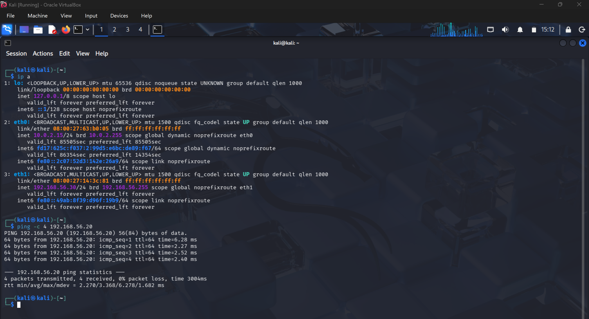
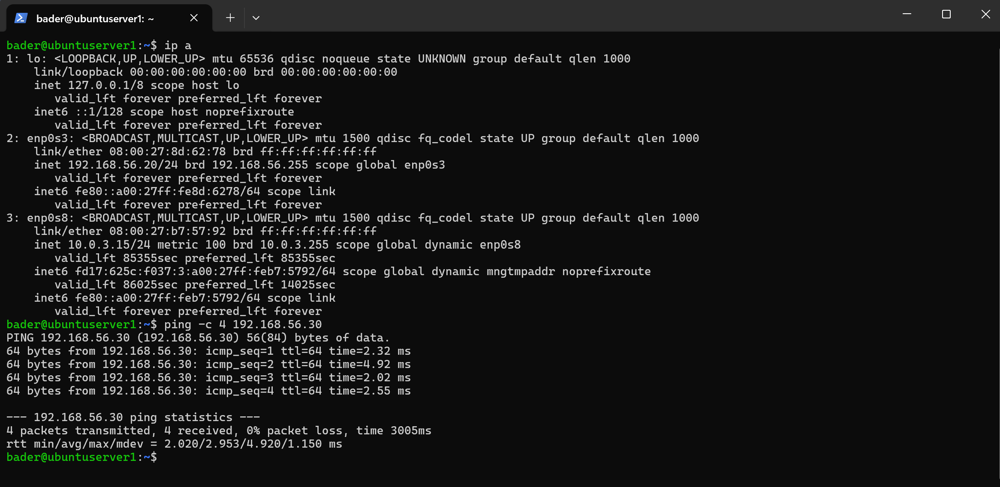
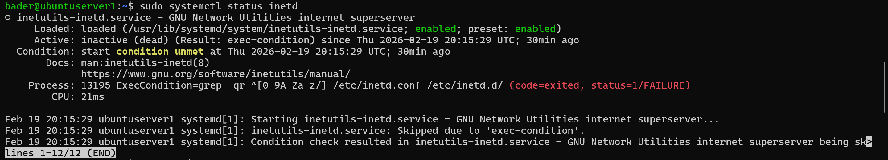
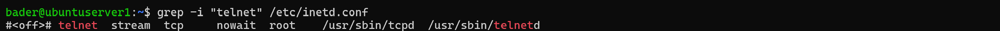
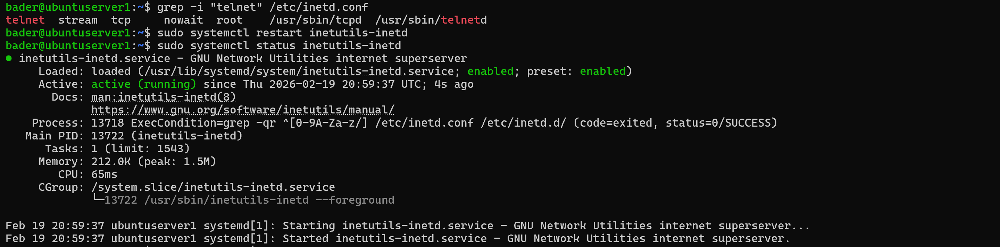
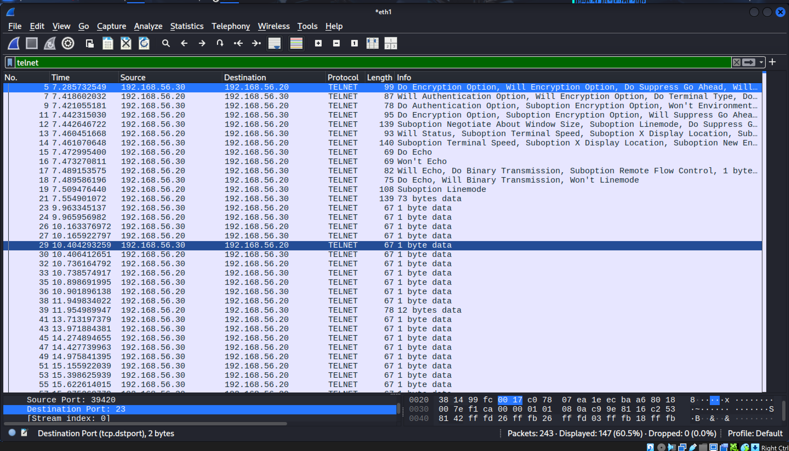
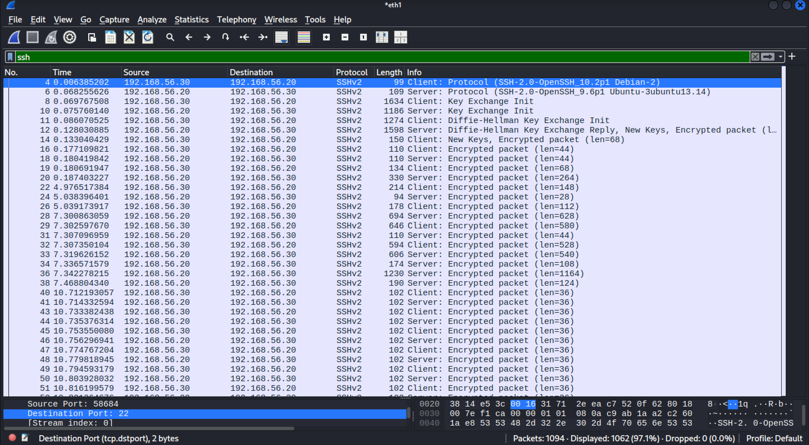
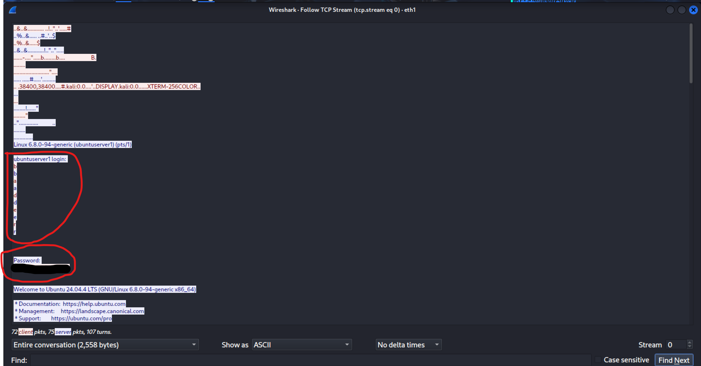
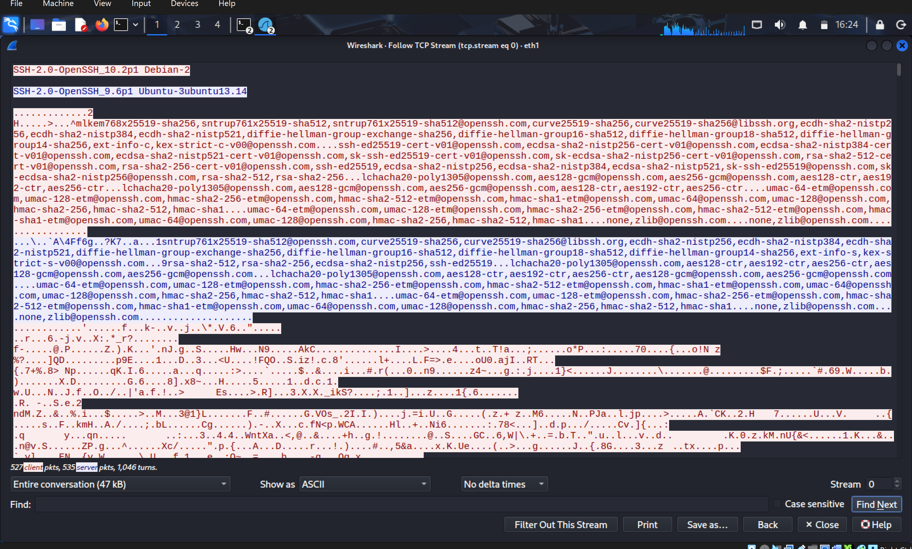

# Telnet vs SSH - Cleartext vs Encrypted Remote Access

## Objective

Demonstrate the security risk of using unencrypted remote access protocols by capturing and comparing Telnet (port 23) and SSH (port 22) traffic in Wireshark. The goal is to show that Telnet transmits everything — including credentials — in plaintext, while SSH encrypts the entire session.

## Lab Environment

| Machine | OS | IP Address | Role |
|---|---|---|---|
| Kali Linux | Kali 2024+ | `192.168.56.30` | Attacker / Analyst |
| Ubuntu Server | Ubuntu 24.04.4 LTS | `192.168.56.20` | Target |

Both VMs are running in VirtualBox on a host-only network (`192.168.56.0/24`).

**Network connectivity confirmed:**





## Tools Used

- **Wireshark 4.6.0** (pre-installed on Kali)
- **Telnet** (GNU inetutils 2.5) — `inetutils-telnetd` server on Ubuntu
- **OpenSSH** — `SSH-2.0-OpenSSH_9.6p1` on Ubuntu, `SSH-2.0-OpenSSH_10.2p1` on Kali
- **UFW** — firewall on Ubuntu, port 22 and [port 23 allowed](screenshots/ufw-allow-port-23-tcp.png)

## Process

### 1. Setting Up the Telnet Server

Installed the Telnet server on Ubuntu:

```bash
sudo apt install telnetd -y
```

Verified the package installed correctly:

```bash
dpkg -l | grep telnet
```

[Screenshot: Telnet packages installed](screenshots/telnet-installed-correctly.png)

### 2. Troubleshooting — Telnet Service Not Listening

After installing, `telnet 192.168.56.20` from Kali returned **"Connection refused."** Investigated:

```bash
sudo ss -tlnp | grep 23          # Nothing listening on port 23
sudo systemctl status inetd       # inactive (dead), "condition unmet", status=1/FAILURE
```



**Root cause:** The Telnet entry in `/etc/inetd.conf` was disabled with a `#<off>#` prefix:



**Fix:** Removed the `#<off>#` prefix and restarted the service:



Port 23 now listening — confirmed with `sudo ss -tlnp | grep 23`.

### 3. Capturing Telnet Traffic

Started Wireshark on Kali's `eth1` interface, then connected to Ubuntu via Telnet:

```bash
telnet 192.168.56.20
```

Logged in and ran: `whoami`, `hostname`, `ls`, `cat /etc/os-release`, then exited.

[Screenshot: Telnet session from Kali](screenshots/telnet-login-and-commands-run-from-kali.png)

Stopped the capture and applied the `telnet` display filter:



### 4. Capturing SSH Traffic

Started a new Wireshark capture on `eth1`, then connected via SSH:

```bash
ssh bader@192.168.56.20
```

Ran the same commands: `whoami`, `hostname`, `ls`, `cat /etc/os-release`, then exited.

Stopped the capture and applied the `ssh` display filter:



## Findings

### Telnet — Everything Exposed

Following the TCP stream of the Telnet capture revealed the full session in plaintext: username, password, every command, and every response.



Even the individual keystrokes of commands were visible character by character:

[Screenshot: Commands visible in TCP Stream](screenshots/TCPStream-some-commands-runs.png)

Telnet sends each keystroke as a separate packet ("1 byte data" in the filtered view). An attacker sniffing the network could reconstruct the entire session in real time.

### SSH — Fully Encrypted

Following the TCP stream of the SSH capture showed only the initial protocol version exchange in readable text (`SSH-2.0-OpenSSH_...`). Everything after the key exchange — authentication, commands, output — was encrypted.



The only readable information is the SSH version strings and the key exchange algorithm negotiation. No usernames, passwords, or session data are exposed.

## Key Takeaways

| | Telnet | SSH |
|---|---|---|
| **Port** | 23 | 22 |
| **Encryption** | None | Full session encryption |
| **Credentials** | Visible in plaintext | Not visible |
| **Commands/Output** | Visible in plaintext | Not visible |
| **Keystroke Visibility** | Each keystroke sent as individual packet | Encrypted, not distinguishable |
| **Use in Production** | Never | Standard for remote access |

Telnet should never be used for remote access on any network. It still appears in legacy systems, IoT devices, and misconfigured environments — which is exactly why knowing how to detect it in a packet capture matters.
